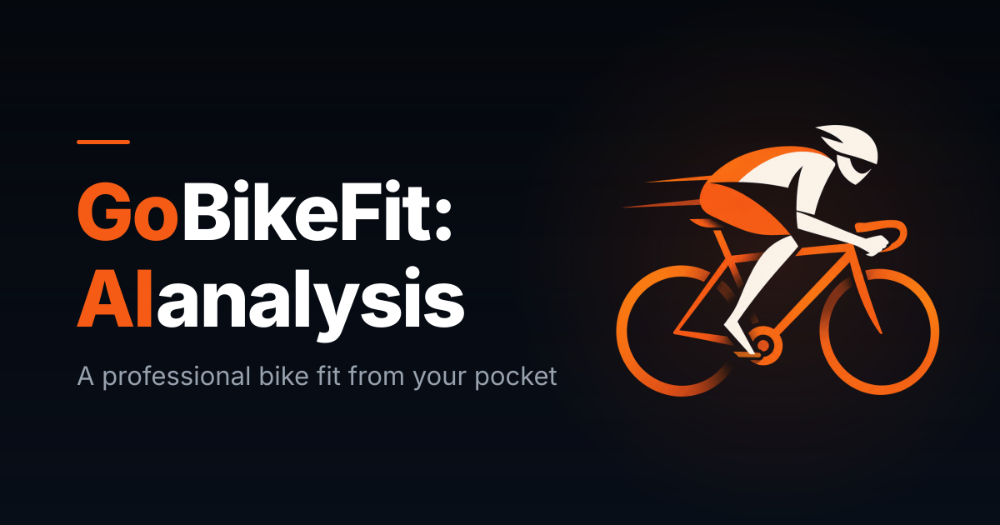

# GoBikeFit — marketing site

The marketing site for **GoBikeFit**, an iOS app that measures your riding position from two
photos and gives back saddle height, reach & drop, and cleat recommendations.

Four hand-written HTML pages sharing two stylesheets and one 18-line script. No build step,
no framework, no dependencies, no forms, no cookies, no analytics. Files are served exactly
as they sit in the repo.



## Live site

Not deployed yet. The canonical and Open Graph tags still point at a placeholder domain —
see [Before launch](#before-launch).

## Quick start

There is nothing to install, compile, or bundle, and no test suite:

```sh
python3 -m http.server 8000   # from the repo root
# open http://localhost:8000
```

Any static host works. Clean URLs come from the `directory/index.html` convention, which
Netlify, Vercel, Cloudflare Pages, GitHub Pages and S3 + CloudFront all resolve natively.

## Structure

```
index.html               /                Landing page
support/index.html       /support         FAQ + contact
legal/terms/index.html   /legal/terms     Terms of Use
legal/privacy/index.html /legal/privacy   Privacy Policy
styles.css                                Shared stylesheet (base)
depth.css                                 Shared stylesheet (depth layer, loads second)
depth.js                                  Scroll-reveal observer
favicon.ico                               Tab icon, 16/32/48px
favicon-96x96.png                         Tab icon, high-DPI
apple-touch-icon.png                      iOS home screen, 180px
site.webmanifest                          PWA manifest
web-app-manifest-*.png                    Manifest icons, 192/512px
og-image.png                              Social card, 1200×630
assets/hero/                              Landing-page hero background
assets/private/                           Privacy-section background
```

## How it's built

Each page is a complete, standalone HTML document — there is no templating, no includes, no
partials. The trade-off is deliberate: zero tooling in exchange for the `<head>`, header and
footer being duplicated four times.

`styles.css` is the base; `depth.css` layers on top and **must load second**. `depth.js` is
the only script — an IntersectionObserver driving the scroll reveal.

The dark theme is built from CSS custom properties in `styles.css`'s `:root`. Use the tokens
rather than hardcoding values.

> Several things here span multiple files and break quietly when changed in isolation — the
> stylesheet load order, a z-index pair, the hero's preload breakpoint. They're documented in
> [`CLAUDE.md`](CLAUDE.md).

## Browser support

The site works in every current browser. Two things are worth knowing:

- **The header's refracting edge is Chromium-only.** It uses `backdrop-filter: url()` with an
  SVG displacement filter, which Safari ([WebKit 245510](https://bugs.webkit.org/show_bug.cgi?id=245510))
  and Firefox don't support. Those browsers get a progressive blur ramp instead, so the edge
  still reads — it smears rather than warps.
- **Known accessibility gap.** The header has no background fill, so the `Support` nav link
  measures roughly 3.3:1 against the bright part of the hero photo, under the 4.5:1 WCAG AA
  threshold. Giving `.site-header` a `rgba(5, 8, 13, 0.3)` background restores ~4.8:1 while
  keeping it mostly see-through.

## License

The markup, CSS and JavaScript are MIT licensed — see [`LICENSE`](LICENSE).

**The assets are not.** Everything in `assets/`, plus `og-image.png`, the favicon and manifest
icon set, the GoBikeFit name and logo, and the Terms of Use and Privacy Policy texts are all
rights reserved. The photography is original and the legal texts are specific to this entity,
so a blanket permissive license would be wrong. Borrow the code, not the content.

---

## Maintenance

### Background photos

Two sets, same shape and same pipeline: `assets/hero/dusk-riding-zoom.png` behind `.hero`, and
`assets/private/dawn-empty-road.png` behind `.section--privacy`. Each is a 1584×672 master with
two committed `.webp` derivatives beside it, served as CSS backgrounds.

Both boxes are taller than they are wide on phones, so `background-size: cover` scales by
*height* there — a width-downscaled mobile variant would be upscaled and look soft. The mobile
file is therefore a centered **crop**, not a smaller rendering of the same frame. Regenerate
with (needs `brew install webp`):

```sh
# $1 = e.g. assets/hero/dusk-riding-zoom or assets/private/dawn-empty-road
cwebp -q 90 -m 6 -sharp_yuv -metadata none "$1.png" -o "$1.webp"

sips -c 672 960 "$1.png" --out /tmp/mobile.png
cwebp -q 90 -m 6 -sharp_yuv -metadata none /tmp/mobile.png -o "$1-960.webp"
```

Only the hero is preloaded. The privacy band is below the fold, so preloading it would compete
with the LCP image.

### Favicons

Generated with [RealFaviconGenerator](https://realfavicongenerator.net). Two deliberate
departures from its default output:

- **No `favicon.svg`.** The generator's SVG is not a vector — it is a 1024×1024 PNG
  base64-embedded in an `<svg>` wrapper, 1228 KB, or 122× `favicon-96x96.png`. Browsers prefer
  the SVG when it is offered, so linking it would cost every visitor over a megabyte for a 16px
  tab icon with no gain in crispness. The `.ico` (16/32/48) and the 96px PNG cover every tab
  size, including high-DPI. If the artwork is ever redrawn as a true vector, add it back — an
  SVG favicon is the right call when it is actually one.
- **Manifest icons are `"purpose": "any"`, not `"maskable"`.** Maskable icons need roughly 20%
  safe-zone padding; this artwork runs edge to edge, so Android would crop the wheels when
  applying its circle mask. Switch back to `"maskable"` only alongside a padded variant.

### Before launch

- **Domain** — `https://gobikefit.com` appears in the canonical and Open Graph tags on all four
  pages. `og:image` must stay an *absolute* URL, so the social card stays broken until this is
  real.
- **Repo metadata** — set the GitHub description and homepage once the site is live.

The Terms of Use entity (`Guo Rong Ma`) and governing law (`Ontario, Canada`) are filled in,
and both legal texts are final. No bracket placeholders remain in any page.
